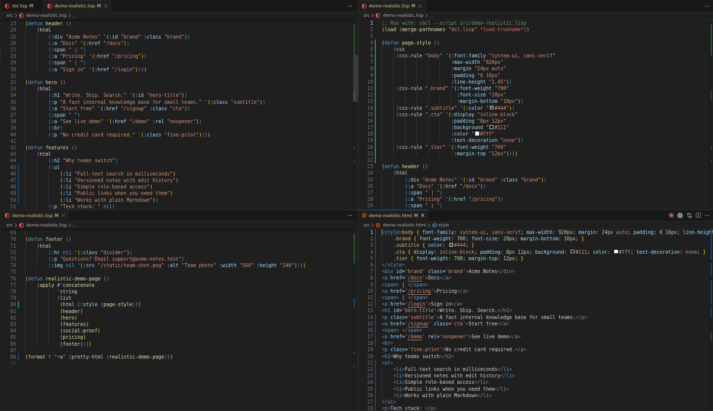
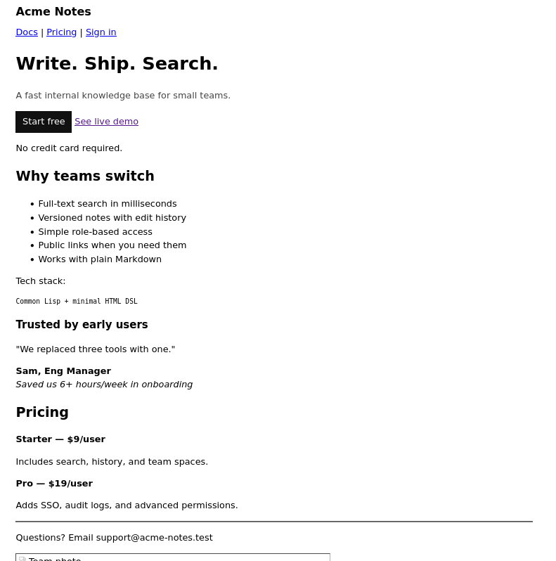
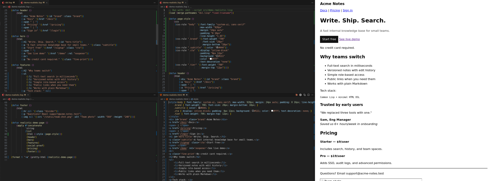
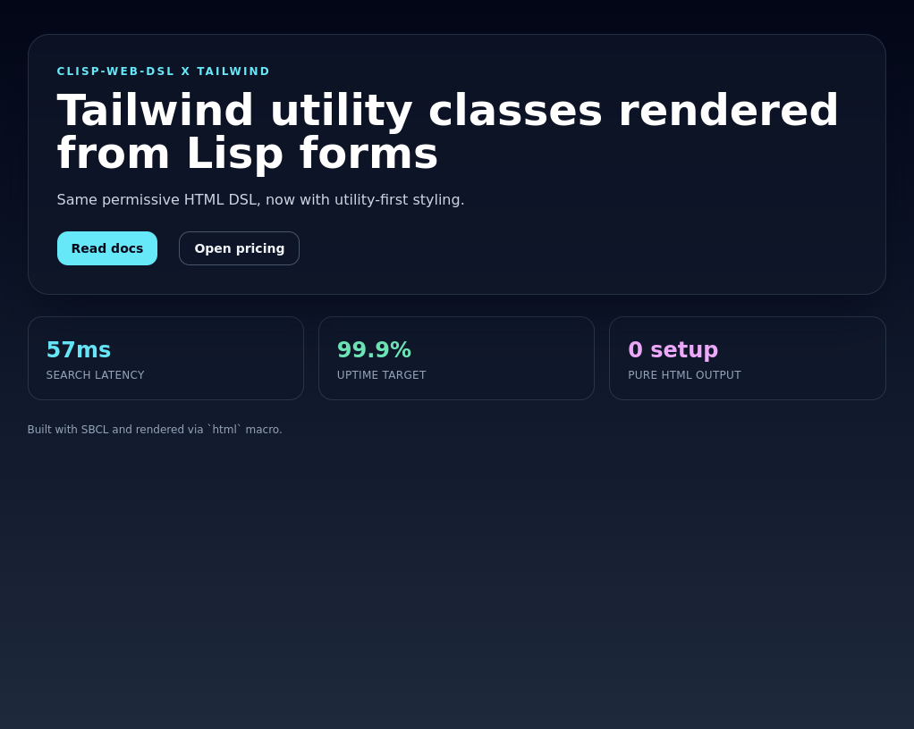

# clisp-web-dsl

Small Common Lisp experiment for a minimal HTML DSL.

## What This Repo Is

This project prototypes an `html` macro in `src/dsl.lisp` that:

- Uses permissive tag/attribute rendering
- Applies lightweight coercions (`class` lists, boolean attrs)
- Emits HTML strings from Lisp forms
- Includes a tiny CSS DSL (`css`, `css-rule`)

It is an exploratory proof-of-concept, not a full web framework.

## Direction

Current direction is permissive and minimal-effort:

- Permissive tags/attributes
- Nested nodes
- Safe escaping by default
- Explicit raw escape hatch via `(raw "...")`
- Tiny CSS DSL via `css` and `css-rule`

## Screenshots

Code:



Render:



Side-by-side (code left, render right):



Tailwind demo render:



## Run

Prerequisite:

- `sbcl` installed

Run once:

```bash
make run
```

Dev watch mode (re-runs when `src/dsl.lisp` changes):

```bash
make dev
```

Run tests (verifies macro inputs/outputs):

```bash
make test
```

Run a larger feature demo page render:

```bash
make demo
```

Run a denser, more realistic page-style demo:

```bash
make demo-realistic
```

Run a Tailwind-styled demo page render:

```bash
make demo-tailwind
```

Direct commands (without Make):

```bash
sbcl --script scripts/run.lisp
sbcl --script scripts/dev.lisp
sbcl --script tests/test.lisp
sbcl --script src/demo.lisp
sbcl --script src/demo-realistic.lisp
sbcl --script src/demo-tailwind.lisp
```

## Layout

- `src/dsl.lisp`: DSL implementation (`html` macro + helpers)
- `src/demo.lisp`: larger one-shot feature demo render
- `src/demo-realistic.lisp`: denser product-page style demo render
- `src/demo-tailwind.lisp`: Tailwind CDN demo render using utility classes
- `scripts/run.lisp`: one-shot run entrypoint
- `scripts/dev.lisp`: file-watch dev runner
- `tests/test.lisp`: input/output verification tests
- `docs/html-dsl-scope.md`: explicit scope/contract for supported HTML subset
- `docs/dsl-design-notes.md`: design tradeoffs and future direction notes
- `docs/compile-time-checking.md`: what compile-time validation can and cannot guarantee
- `assets/pic_code.png`, `assets/pic_render.png`, `assets/pic_all.png`, `assets/image.png`: project screenshots

## When You Were Working On It

Based on git history, active work in this repo happened between:

- **February 1, 2023** (`98c012d` - `Initial commit`)
- **February 2, 2023** (`af71910` - `things`)

So this was worked on over roughly a 1-2 day window in early February 2023.
